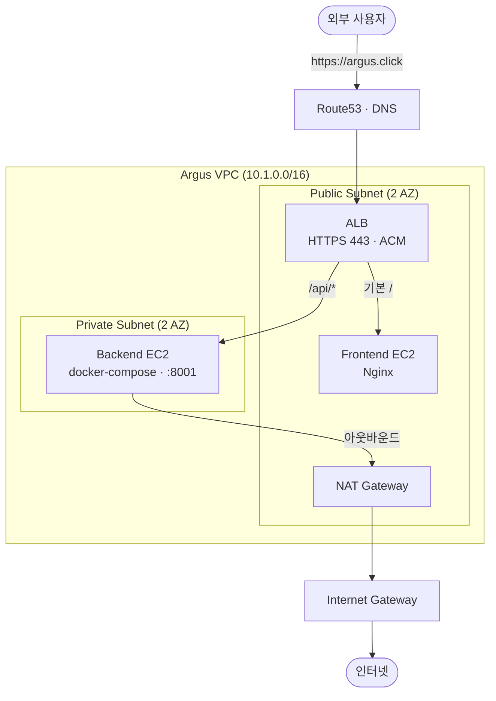

# Argus Infra — Networking & Edge

진단 플랫폼 **Argus**의 네트워킹·엣지 계층을 **Terraform(IaC)** 으로 구축한 저장소입니다.
외부 트래픽을 HTTPS로 안전하게 받아 **프론트엔드(공개망)** 와 **백엔드(격리망)** 로 분리 라우팅합니다.

- **담당 파트**: Networking & Edge (VPC / ALB / DNS)
- **스택**: Terraform, AWS (VPC · ALB · Route53 · ACM · NAT · Security Group)
- **리전**: `ap-northeast-2` (서울)

---

## 아키텍처



**트래픽 흐름**

1. 사용자가 `https://argus.click` 접속 → **Route53**이 **ALB**로 안내
2. **ALB**가 443(HTTPS)을 **ACM 인증서**로 처리 (80 → 443 자동 리다이렉트)
3. 경로 분기: 기본(`/`) → **Frontend(Nginx)**, `/api/*` → **Backend(:8001)**
4. 백엔드 아웃바운드는 **NAT → IGW**로만 (외부에서 백엔드 직접 진입 불가)

---

## 디렉터리 구조

```
.
├── README.md
└── terraform/
    ├── provider.tf   # Terraform·AWS 프로바이더 & 원격 상태 저장소 설정
    ├── variables.tf  # 입력 변수(리전·CIDR·도메인·포트 등)
    ├── vpc.tf        # VPC·서브넷·IGW·NAT·라우팅 테이블
    ├── security.tf   # 3계층 보안그룹 (ALB → Frontend → Backend)
    ├── acm.tf        # SSL/TLS 인증서 발급 + DNS 자동 검증
    ├── dns.tf        # Route53 호스티드존 + 도메인 레코드
    ├── alb.tf        # ALB·타겟그룹·리스너·라우팅 규칙
    └── outputs.tf    # 타 팀원 참조용 출력값
```

---

## 파일별 역할

| 파일 | 역할 | 주요 리소스 |
|---|---|---|
| `provider.tf` | 클라우드·버전·상태 저장소 정의, 공통 태그 | `terraform`, `provider "aws"` |
| `variables.tf` | 반복 설정값을 변수로 중앙 관리 | `variable` |
| `vpc.tf` | 사설 네트워크의 뼈대 (2 AZ, 단일 NAT) | `aws_vpc`, `aws_subnet`, `aws_internet_gateway`, `aws_nat_gateway`, `aws_route_table` |
| `security.tf` | 최소 권한 3계층 방화벽 | `aws_security_group` × 3 |
| `acm.tf` | HTTPS 인증서 발급 + DNS 검증 자동화 | `aws_acm_certificate`, `aws_acm_certificate_validation` |
| `dns.tf` | 도메인 ↔ ALB 연결 | `aws_route53_zone`, `aws_route53_record` |
| `alb.tf` | 진입점·부하분산·경로 라우팅 | `aws_lb`, `aws_lb_target_group`, `aws_lb_listener`, `aws_lb_listener_rule` |
| `outputs.tf` | 타 파트가 참조할 값 노출 | `output` |

### 개념 한 줄 요약
- **VPC**: AWS 안의 격리된 사설 네트워크
- **Public/Private Subnet**: 인터넷 노출 구역 / 외부 직접접근 차단 구역
- **IGW / NAT Gateway**: 인터넷 정문 / 사설망의 아웃바운드 전용 통로
- **Security Group**: 리소스 단위 방화벽 (인바운드/아웃바운드 규칙)
- **ACM**: SSL/TLS 인증서 자동 발급·갱신
- **Route53**: 도메인 ↔ 서버 주소 변환(DNS)
- **ALB / Target Group**: L7 로드밸런서(경로 라우팅) / 트래픽 대상 서버 묶음

---

## 보안그룹 정책 (최소 권한 3계층)

| 보안그룹 | 인바운드 | 출처 |
|---|---|---|
| `alb-sg` | 80, 443 | 인터넷 `0.0.0.0/0` |
| `frontend-sg` | 80 | `alb-sg` |
| `backend-sg` | 8001 | `frontend-sg` + `alb-sg` |

- IP 대역이 아닌 **앞단 보안그룹 참조**로 접근 경로를 강제
- **SSH(22) 미개방** — 인스턴스 접근은 SSM 사용 (공격 표면 최소화)

---

## 사용 방법

### 사전 요구사항
- [Terraform](https://developer.hashicorp.com/terraform/downloads) >= 1.3.0
- AWS 자격 증명 설정 (`aws configure` 또는 환경변수)
- 대상 리전에서 리소스를 생성할 수 있는 IAM 권한

### 실행

```bash
cd terraform

terraform init      # provider 다운로드 및 초기화
terraform plan      # 생성될 리소스 미리보기
terraform apply     # 실제 인프라 생성
```

### 주요 입력 변수 (`variables.tf`)

| 변수 | 기본값 | 설명 |
|---|---|---|
| `aws_region` | `ap-northeast-2` | 배포 리전 |
| `project_name` | `argus` | 리소스 이름 prefix |
| `vpc_cidr` | `10.1.0.0/16` | VPC 대역 (Onde와 분리) |
| `public_subnet_cidrs` | `10.1.1.0/24`, `10.1.2.0/24` | 퍼블릭 서브넷 |
| `private_subnet_cidrs` | `10.1.11.0/24`, `10.1.12.0/24` | 프라이빗 서브넷 |
| `availability_zones` | `ap-northeast-2a`, `2c` | 가용영역 |
| `domain_name` | `argus.click` | 서비스 도메인 |
| `backend_port` | `8001` | 백엔드 API 포트 |

### 주요 출력값 (`outputs.tf`)
`vpc_id`, `public_subnet_ids`, `private_subnet_ids`, `alb_dns_name`,
`frontend_target_group_arn`, `backend_target_group_arn`,
`acm_certificate_arn`, `route53_zone_id`, `route53_name_servers`

---

## ⚠️ 배포 시 주의사항

1. **원격 상태 저장소(state backend)**
   `provider.tf`의 S3 backend는 주석 상태입니다. 활성화 시 **Argus 전용** 버킷/락 테이블
   (`argus-tfstate-bucket-<계정ID>` / `argus-tfstate-lock`)을 사용하세요.
   **Onde의 tfstate 버킷을 절대 재사용 금지** (상태 충돌로 리소스 삭제/덮어쓰기 위험).

2. **도메인 네임서버(NS) 등록** *(수동 1회)*
   호스티드존을 새로 생성하므로, `apply` 후 출력되는 `route53_name_servers` 값을
   도메인 등록기관의 네임서버로 등록해야 DNS·ACM 검증이 완료됩니다.

3. **역할 경계**
   타겟그룹은 이 저장소에서 **정의만** 하며, 실제 EC2 인스턴스 연결(attachment)은
   컴퓨팅 담당 파트에서 `outputs`의 타겟그룹 ARN을 참조하여 수행합니다.
